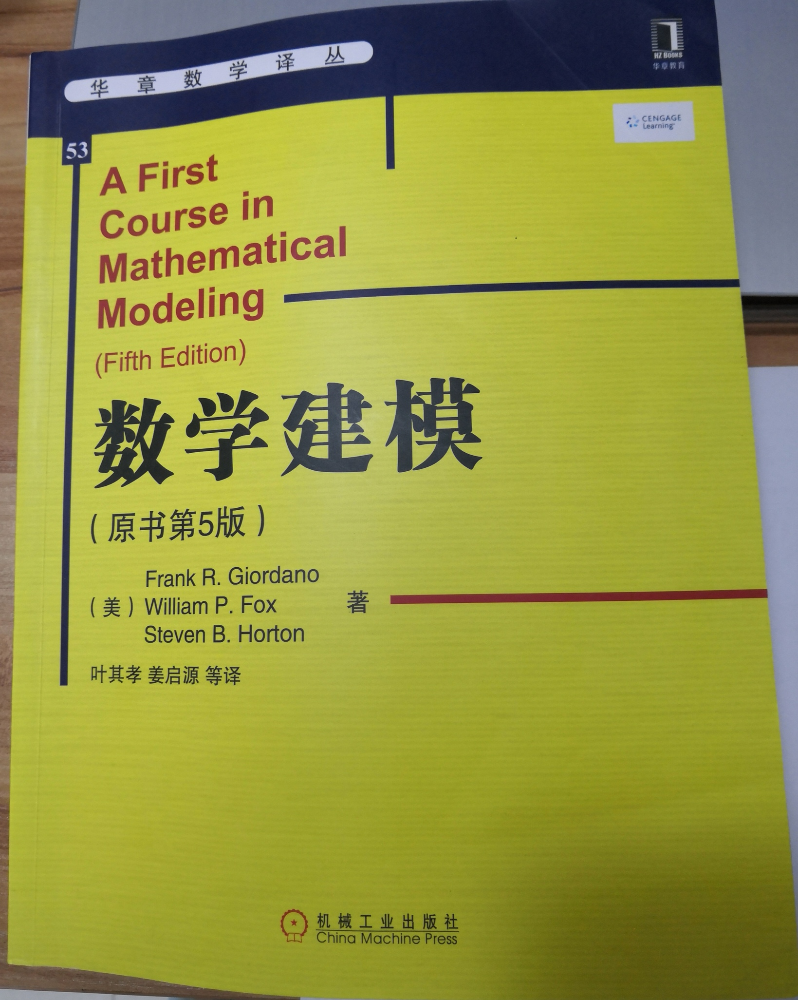

# Mathematical Modeling 数学建模
最近买了一本书：《A First Course in Mathematical Modeling》，中文译本是《数学建模》，我打算利用本项目来一一实践书中的例题以及习题，可能还会额外了解一些建模比赛的题目。

数学是科学的基础，我对数学一直保有持续的纯粹的热爱，数学建模可以把数学玩起来、真正用起来，所以学以致用，用以促学，学用相长。

